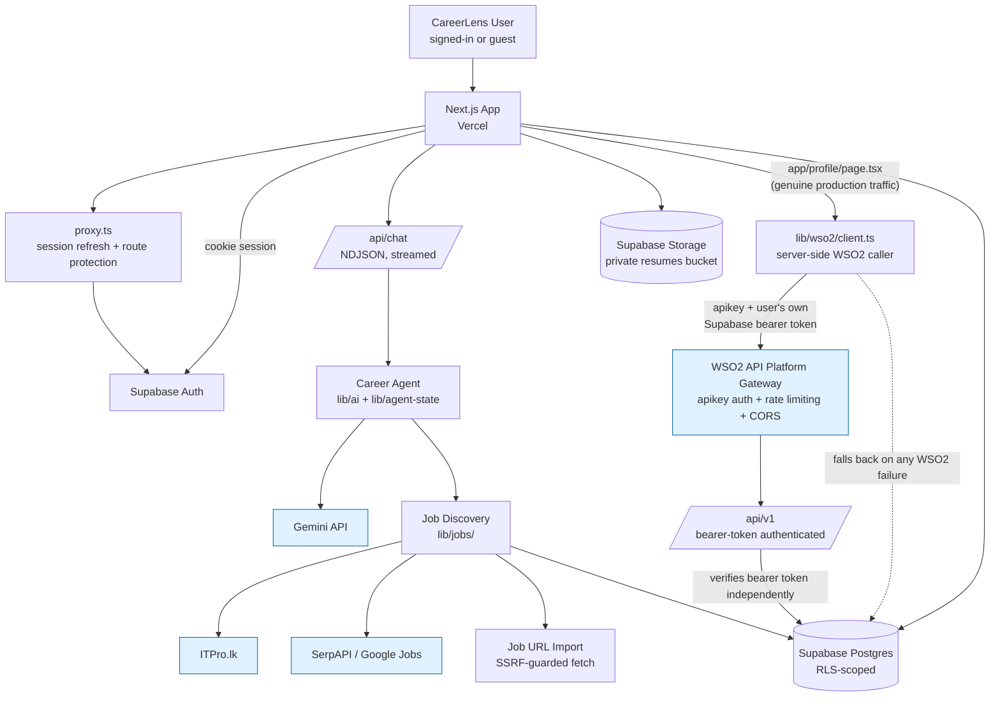

# Production Architecture

High-level view of CareerLens AI as actually deployed, reflecting the
real code paths in this repository — not an aspirational target. See
[`ARCHITECTURE.md`](ARCHITECTURE.md) for the full application-layer
breakdown and [`WSO2_INTEGRATION.md`](WSO2_INTEGRATION.md) for the
gateway layer's own detail.

## Layer responsibilities

| Layer | Responsible for |
|---|---|
| `proxy.ts` | Edge-level session refresh + redirecting unauthenticated requests away from protected pages (guest-accessible: `/chat` only) |
| Supabase Auth | The single identity system — no second user database, no WSO2-issued identity; WSO2 never replaces this |
| `/api/chat` | The conversational surface — NDJSON streamed replies, job search/URL-analysis tool-calling, chat persistence. Never sits behind WSO2 (a streaming endpoint isn't what an API gateway product is for) |
| `lib/jobs/` | Provider-agnostic job discovery (ITPro.lk, SerpAPI, pasted-URL import), deterministic normalization/dedup/matching — the LLM never invents a listing or a score |
| `lib/wso2/` | The one place this app calls *out* to the WSO2 gateway — typed errors, correlation IDs, safe logging, a single bounded retry on GETs only |
| `/api/v1` | The versioned, non-streaming REST API — bearer-token authenticated independently of WSO2, meant to sit behind it for both external consumers and (as of this session) this app's own first-party pages |
| Supabase Postgres | Source of truth, RLS-scoped per user on every owner-scoped table |

## Why `/api/chat` is not behind WSO2

`/api/chat` streams NDJSON chunks as Gemini generates them — an API
gateway product like WSO2 is built around request/response semantics
(rate limiting, analytics, OAuth2 on a discrete call), not a long-lived
stream. Keeping it direct also avoids adding an external hop's latency
to every keystroke-driven chat turn. `/api/v1` — deliberately
non-streaming — is the layer designed to sit behind WSO2.

## Why only `/profile`'s read goes through WSO2 so far

Routing a page through an external gateway adds a real dependency: if
WSO2 is slow or briefly unavailable, that page shouldn't break for users
who never asked for a gateway hop. `getCareerProfileViaWso2OrDirect`
(`lib/career-profile/get-profile-via-wso2.ts`) is deliberately narrow and
provably safe — it's real production traffic when configured, and falls
back to the exact same direct call that already worked before WSO2
existed, on any WSO2 failure. Expanding this pattern to other pages is a
mechanical repeat of the same wrapper, once you've confirmed this one
works end-to-end against your real WSO2 key.
